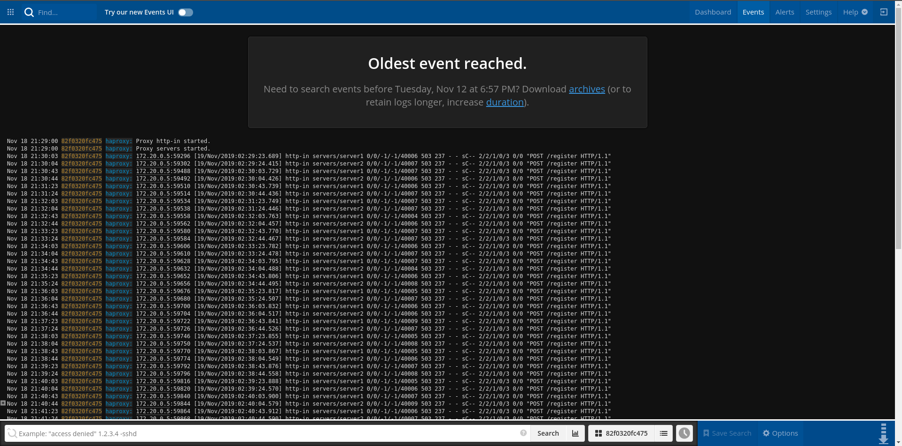

# Project 6 Changes and Updates
https://travis-ci.com/Haotian9850/internet-scale-app.png?branch=master
## New features since release `0.0.6`
### The following features are made available in project 6:
1. Added Travis CI to the project
2. Added full-page redis caching to `presentation` layer
3. Added a load balancer based on `haproxy`
4. Added front-end integration testing with `selenium`
5. Added `jmeter` performance testing


### The following features are deprecated in project 6:
N/A


 
### Portia: user stories (continuingly updated)
1. As the seller, I want to inform the customer what type of animal does the pet belongs to
2. As the seller, I want to update the information of the pet to let the customer know the most up-to-date condition of the pet
3. As the seller, I want to request to cancel sales when the pet is no longer available
4. As the customer, I want to see all the pets listed by all the sellers
5. As the customer, I want to type and search about the pet I want
6. As the customer, I want to change and update my profile to give my most up-to-date information to the seller
7. As the seller, I want to be able to log in with my account, so I can ensure nobody else else can edit information of my pets without my permission
8. As the seller, I want to be able to log out with my account. If I log in to the website in a computer in public, I want to ensure nobody else can use my account after I leave and am no longer using that computer
9. As the customer, I want to see all pets specified by a specific seller because I really all the pets in his / her inventory and want to follow that seller
10. As the seller, I want to be able to reset my account password so I can log in and retrieve my inventory information if I happened to forget the account password


### Deployment & Testing
#### Suggested testing workflow
1. Ensure the init script for each container is executable by running the following command:
    ```
    $ sudo chmod -R 777 internet-scale-app_00X
    ```
1. Ensure that a `mysql` container with a database named `cs4260` and a user `'www'@'%'` who is granted all privileges to `cs4260` and `test_cs4260` (the test database Django test `Client` will create later). Otherwise, `docker-compose up` will not bring up any container
2. Add `mysql` container to docker networks `backend` by running the following command:
    ```
    $ sudo docker network connect internet-scale-app_backend mysql
    ```
3. Run `sudo docker-compose up` in project root folder to bring up docker containers
4. Head to `localhost:8006/homepage` to access the project:
    - Since no data is loaded from fixture, there will be a red `[No pets available]` status message on top homepage
    - To create a new pet, click `[Register]` to register as a new user
    - After registeration, user will be redirected to login page. Click `[Log in]` after filling in user credentials. A user who is already logged in will be redirected to homepage
    - After logging in, click `[Create a new pet!]` to create a new pet
    - After a new pet is created, user will be redirected to homepage
    - Click `[Check it out!]` on each pet created to view its detailed information
    - Type in the search bar and then click `[Search]` to search pets. Search result page will contain a list of pets matching search phrase entered and will be sorted by views. Pets that have more than 5 views will be listed as `hot listing`. Only user logged contributes to a pet's view count
    - Click `[Log out]` to log out

#### Selenium integration testing
1. SSH into `selenium-test` container:
    ```
    $ sudo docker exec -it selenium-test /bin/bash
    ```
2. Run the following command to run selenium tests:
    ```
    $ python3 test.py
    ```

    Here is a sample screenshot of selenium test results:

    

    *Note: selenium test can only be run with a **empty** database.*

#### Performance testing
1. `jmeter` performance tests will be performed automatically when `docker-compose` starts. Test result is stored in `jmeter/JmeterTestResult.log`

    Here is a sample testing result:

    

#### Load balancing
1. `haproxy` load balancer utilize two backend servers, `presentation-0` and `presentation-1` to distribute traffics (roundrobin algorithm). As a result, the project entrypoint has changed to `load-balancer`'s export point at `localhost:8006/homepage`
2. Logging: head to `https://papertrailapp.com/dashboard` to view `haproxy` logs with the following credentials:
    ```
    Email: hl7gr@virginia.edu
    Password: 123456789
    ```
    Here is a sample screenshot of a `haproxy` session:

    

#### Caching
1. Full-page redis caching on pet_detail page is implemented in `presentation-x` and `redis` container. To verify caching insertion, SSH into the `redis` container and run the following command:
    ```
    $ sudo docker exec -it redis /bin/bash
    root@0fasrbfds6ef1:redis-cli
    root@0fasrbfds6ef1:SELECT 0
    root@0fasrbfds6ef1:KEYS * 
    ```
2. Caching invalidation strategy: redis cache is invalidated every 20 minutes (same invalidation time as a user's `session` to ensure efficient cache usage)


