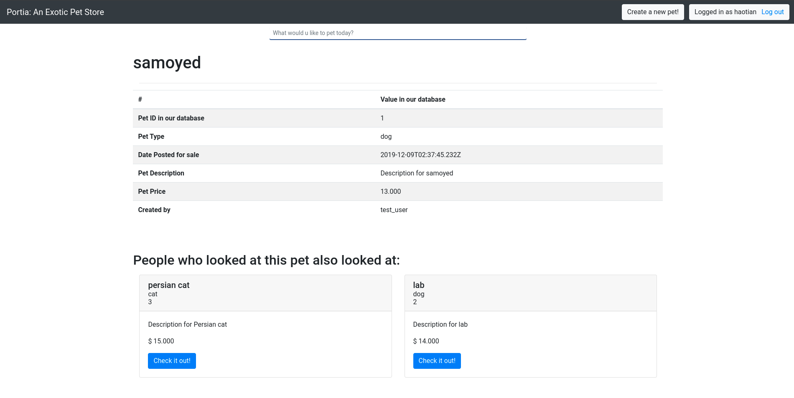
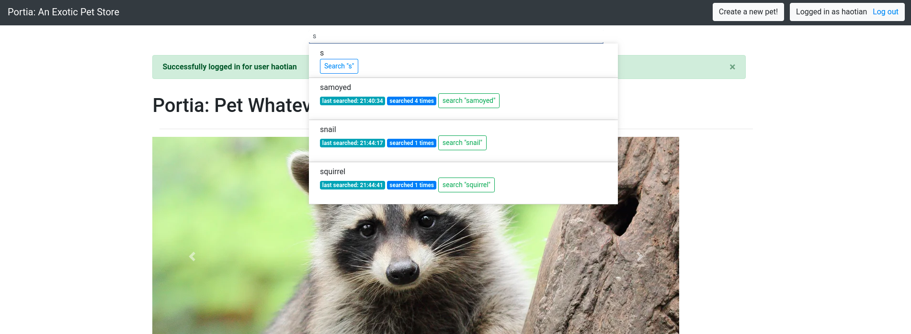

# Project 7 Changes and Updates
[](https://travis-ci.com/Haotian9850/internet-scale-app)

## New features since release `0.0.7`
### The following features are made available in project 7:
1. Added spark-based pet recommendation system
2. Added an autocomplete search bar with search history metrics


### The following features are deprecated in project 7:
1. Removed `jmeter` performance testing to avoid `503` error upon `dock-compose up` on low-grade hardware


 
### Portia: user stories (continuously updated)
1. As the seller, I want to inform the customer what type of animal does the pet belongs to
2. As the seller, I want to update the information of the pet to let the customer know the most up-to-date condition of the pet
3. As the seller, I want to request to cancel sales when the pet is no longer available
4. As the customer, I want to see all the pets listed by all the sellers
5. As the customer, I want to type and search about the pet I want
6. As the customer, I want to change and update my profile to give my most up-to-date information to the seller
7. As the seller, I want to be able to log in with my account, so I can ensure nobody else else can edit information of my pets without my permission
8. As the seller, I want to be able to log out with my account. If I log in to the website in a computer in public, I want to ensure nobody else can use my account after I leave and am no longer using that computer
9. As the customer, I want to see all pets specified by a specific seller because I really all the pets in his / her inventory and want to follow that seller
10. As the seller, I want to be able to reset my account password so I can log in and retrieve my inventory information if I happened to forget the account password


### Deployment & Testing
#### Suggested testing workflow
1. Ensure the init script for each container is executable by running the following command:
    ```
    $ sudo chmod -R 777 internet-scale-app_00X
    ```
1. Ensure that a `mysql` container with a database named `cs4260` and a user `'www'@'%'` who is granted all privileges to `cs4260` and `test_cs4260` (the test database Django test `Client` will create later). Otherwise, `docker-compose up` will not bring up any container
    ```
    $ sudo docker run --name mysql -d -e MYSQL_ROOT_PASSWORD='$3cureUS' -v /media/haotian/documents-local/CS4260/internet-scale-app/db:/var/lib/mysql  mysql:latest
    ```

    ```
    # mysql -uroot -p'$3cureUS'
    ```
2. Add `mysql` container to docker networks `backend` by running the following command:
    ```
    $ sudo docker network connect internet-scale-app_backend mysql
    ```
    *Depending on your `docker` version, network may be named to `internetscaleapp_backend`*
3. Run `sudo docker-compose up` in project root folder to bring up docker containers

    *Note: it is possible that `spark-worker` will try to connect to `spark-master` multiple times before it forms a cluster with it. This is OK since spark (and most other distributed computing frameworks) will always attempt connecting until it forms a cluster.*
4. Head to `localhost:8006/homepage` to access the project:
    - After `docker-compose` is fully started, start a spark script to start recommendation service by running the following command (in a separate terminal):
    ```
    $ sudo chmod 777 data/update_recommendation.sh
    $ ./data/update_recommendation.sh
    ```
    *Recommendations will be updated every 60 seconds*
    - Since no data is loaded from fixture (there is **no fixture**), there will be a red `[No pets available]` status message on top homepage
    - To create a new pet, click `[Register]` to register as a new user first
    - After registeration, user will be redirected to login page. Click `[Log in]` after filling in user credentials. A user who is already logged in will be redirected to homepage
    - After logging in, click `[Create a new pet!]` to create a new pet
    - After a new pet is created, user will be redirected to homepage
    - Click `[Check it out!]` on each pet created to view its detailed information
    - Since pet details are cached in `redis` container (cache will be invalidated every 20 minutes / when a user logs out). When a pet is cached, accessing it detail page **will not be logged (as a result, its recommendation feed will not be updated either)**. Therefore, to test out the recommendation service, it is recommended to create multiple users / log out and re-log in again between viewing each pet. **Only co-viewed pet with 3 or more views will be considered as a recommendation. Recommendations are updated every 60 seconds by running `update_recommendation.sh`** The recommendation feed look like as follows:

    

    - To test out the updated search bar, simply type in it: suggestions from search history will appear (if the user has one) as follows:

    
    *Note: the suggestion panel will not show if input does not match any item from search history or when it is the first time a user searches (i.e. when there is no search history)*

    - If the suggestion panel is blocking any content on the page (for example: the login and register page), simply click **outside** of the suggestion panel to clear it


